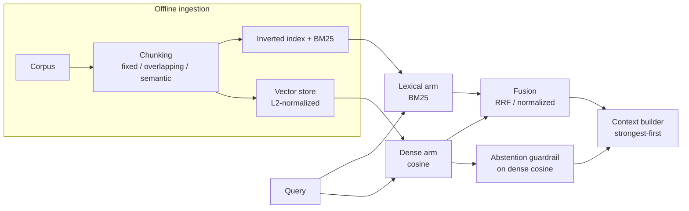

# hybrid-rag-eval

[](https://github.com/RohanAdithyaGarlapati/hybrid-rag-eval/actions/workflows/eval.yml)


[](https://hybrid-rag-eval-l4jtel6cptvubkvg2xxgsm.streamlit.app/)

A hybrid (lexical plus dense) retrieval system with a statistical evaluation harness,
built to be read as a portfolio piece: every module is small, tested, and honest about
what it does. It ships a hand authored 40 document handbook corpus on ML systems
engineering, a 50 question labeled query set split into lexical and paraphrase halves,
10 unanswerable questions for abstention calibration, and an experiment grid that reports
recall, MRR, and nDCG with paired significance testing and multiple comparison correction.

## Results at a glance

Same corpus and queries, two embedders. The semantic model earns its keep on the
paraphrase split, where character overlap matching cannot help:

| Embedder | overall recall@5 (hybrid-rrf) | dense recall@5, paraphrase split |
|---|---|---|
| HashingEmbedder (non semantic fallback) | 0.940 | 0.760 |
| all-MiniLM-L6-v2 (semantic) | 1.000 | 0.960 |

Every run stamps the report with commit SHA, dataset SHA256, and the embedder's
`is_semantic` flag, so the two can never be confused. See `reports/experiment_report.md`.

## Architecture



Key design choices worth calling out:

* **Abstention is thresholded on dense cosine similarity, not on the fused RRF score.** RRF scores
  are a function of rank position only and carry no absolute confidence, so they are the wrong
  signal for deciding whether to answer. The dense cosine of the best chunk is a real confidence.
* **Context is built strongest first** to mitigate the lost in the middle effect.
* **The candidate pool is wider than k** before fusion, so fusion has material to reorder.
* **Everything reproducible is seeded and stamped**: the report carries the commit SHA, the dataset
  SHA256, and the embedder identity.

## Honest statement on the reported numbers

The evaluation supports two embedders:

* `SentenceTransformerEmbedder` wrapping `all-MiniLM-L6-v2` (semantic, `is_semantic=True`).
* `HashingEmbedder`, a dependency free character n gram hashing fallback (`is_semantic=False`).

By default the harness auto selects the semantic `all-MiniLM-L6-v2` model. When the weights
cannot be downloaded (an offline or firewalled environment), `build_embedder("auto")` warns
loudly, falls back to the `HashingEmbedder`, and stamps `is_semantic=False` in the report, so a
semantic run and a fallback run can never be mistaken for one another.

The two embedders make a deliberate point. Lexical questions are essentially solved by BM25 alone.
The paraphrase split, which shares little surface vocabulary with the gold document, is where a
real dense encoder pulls ahead: the semantic model lifts dense paraphrase recall well above the
hashing fallback, because character overlap cannot bridge a vocabulary gap that meaning can. That
gap, visible in the by kind table, is the whole reason a hybrid system exists.

To reproduce both paths:

```bash
# semantic (needs network access to the model hub on first run)
pip install -e ".[semantic]"
python -m hybridrag.evaluate --embedder sentence-transformers

# offline fallback (no extra dependencies)
python -m hybridrag.evaluate --embedder hashing
```

### Fallback baseline numbers (HashingEmbedder, seed 0)

These verified numbers come from the dependency free fallback and serve as the floor the semantic
model improves on. Overall recall@5 / MRR / nDCG@10 for a few variants:

| chunking | mode | recall@5 | MRR | nDCG@10 |
|---|---|---|---|---|
| overlapping | lexical (BM25 baseline) | 0.980 | 0.940 | 0.954 |
| overlapping | hybrid-rrf | 0.940 | 0.878 | 0.902 |
| overlapping | dense | 0.880 | 0.847 | 0.873 |
| semantic | lexical | 0.980 | 0.969 | 0.976 |

By question kind (recall@5), overlapping chunking: lexical questions 1.000, paraphrase questions
0.960 for BM25 and 0.760 for dense. Abstention operating point: threshold 0.260 on dense cosine
similarity, catching 100 percent of unanswerable questions at a 26 percent false abstention rate.
See `reports/experiment_report.md` for the full grid, the paired Wilcoxon comparisons with
Holm-Bonferroni correction, and bootstrap confidence intervals.

With BM25 as such a strong lexical baseline on this corpus, no fallback variant beats it after Holm
correction. That is the honest result for a non semantic embedder, and is precisely the gap the
semantic model closes on the paraphrase split.

## Repository layout

```
data/build_dataset.py      Hand authored corpus + questions; validates every gold id.
src/hybridrag/
  chunking.py              fixed / overlapping / semantic chunking -> frozen Chunk dataclasses.
  bm25.py                  Inverted index + BM25 from scratch, positional phrase search.
  embeddings.py            Embedder protocol; SentenceTransformer + Hashing; build_embedder("auto").
  vectorstore.py           L2 normalized matrix, cosine search via argpartition, metadata filter.
  fusion.py                Reciprocal rank fusion and normalized score fusion.
  retriever.py             HybridRetriever (lexical/dense/hybrid), abstention, context builder.
  metrics.py               recall@k, hit@k, precision@k, MRR, nDCG, per query + aggregate.
  stats.py                 Wilcoxon (MWU fallback), rank biserial, bootstrap CI, Holm-Bonferroni.
  _llm.py                  Provider agnostic LLM client (Anthropic + free Groq fallback).
  generator.py             Grounded answer generation with a versioned prompt.
  judge.py                 LLM as judge: faithfulness + answer relevance, key optional.
  pipeline.py              End to end RAG: retrieve -> abstain/generate -> judge.
  evaluate.py              Experiment grid, stats, abstention sweep, Markdown report.
  api.py                   FastAPI /health /search /answer /generate with Pydantic validation.
  cli.py                   index / query / ask / evaluate subcommands.
tests/                     82 tests (chunking, bm25, embeddings, fusion, metrics, stats, retriever, api, generation).
scripts/eval_gate.py       CI quality gate on recall@5.
.github/workflows/eval.yml Lint + tests + evaluation gate.
```

## Requirements and Python version

The project targets **Python 3.12** (`requires-python = ">=3.12"` in `pyproject.toml`). The code is
written to run on 3.10+ as well, and the test suite uses `pythonpath = ["src"]` so no install is
required just to run the tests.

## How to run

```bash
# 1. Install (dev tools included)
pip install -e ".[dev]"

# 2. Build the dataset (writes corpus.jsonl, questions.jsonl, unanswerable.jsonl)
python data/build_dataset.py

# 3. Run the tests
pytest -q

# 4. Run the full evaluation and write the report
python -m hybridrag.evaluate --out reports/experiment_report.md

# 5. Run the CI quality gate locally
python scripts/eval_gate.py

# CLI
python -m hybridrag.cli index --strategy overlapping
python -m hybridrag.cli query "how does bm25 rank documents" --mode hybrid-rrf
python -m hybridrag.cli evaluate

# API
uvicorn hybridrag.api:app --reload    # then GET /health, POST /search, POST /answer
```

## End-to-end RAG: generation and LLM-judged faithfulness

Beyond retrieval, the pipeline can generate a grounded answer and grade it. The flow
in `pipeline.py` is: retrieve, abstain if confidence is below threshold, otherwise
generate an answer constrained to the retrieved context, then judge that answer for
faithfulness (is every claim supported by the context) and answer relevance.

Generation and judging are provider agnostic (`_llm.py`) and key optional:

* If `ANTHROPIC_API_KEY` is set, it uses the Anthropic API (model from `ANTHROPIC_MODEL`,
  default `claude-3-5-sonnet-20241022`).
* Else if `GROQ_API_KEY` is set, it uses the free Groq tier via the OpenAI compatible
  SDK (model from `GROQ_MODEL`, default `openai/gpt-oss-20b`).
* If neither key is present, generation and judging skip cleanly: retrieval still runs,
  the answer is reported as unavailable, and nothing errors.

Every generated answer is stamped with the `provider` and `model` that produced it, so
runs stay auditable. Run it from the CLI:

```bash
# free path (no credit card): get a key at console.groq.com
export GROQ_API_KEY=gsk_...
python -m hybridrag.cli ask "how does bm25 rank documents"
```

Example output (Groq, free tier):

```json
{
  "answer_source": "generated",
  "provider": "groq",
  "model": "openai/gpt-oss-20b",
  "faithfulness": 1.0,
  "answer_relevance": 1.0,
  "doc_ids": ["doc-bm25", "doc-mrr", "doc-recall-at-k"]
}
```

The same is exposed at `POST /generate` in the API. Out-of-corpus questions abstain
before spending a call, so the guardrail is enforced end to end.

## License

MIT.
